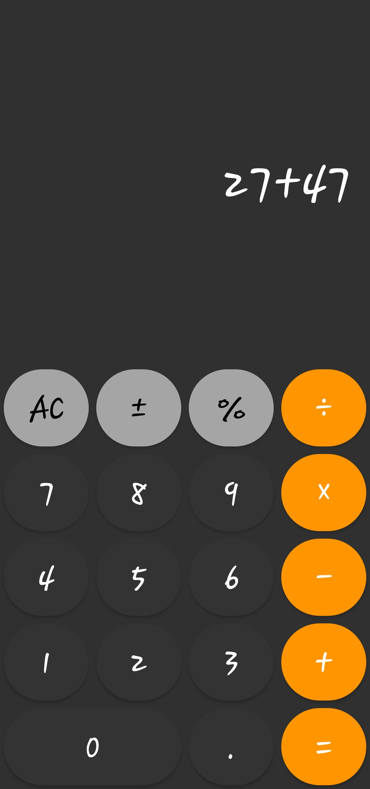
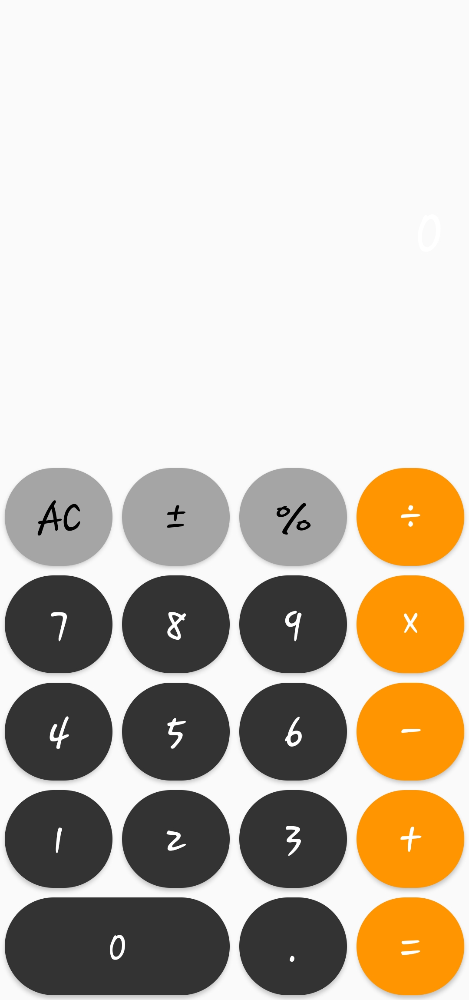

# 🔢 Calculator App – Android (Java)

A simple calculator application built using **Java** in **Android Studio**. This app allows users to perform basic arithmetic operations with a clean and user-friendly interface. It's a beginner-friendly project suitable for learning Android development and Java fundamentals.

---

## 📱 Features

- Basic arithmetic operations:
  - Addition
  - Subtraction
  - Multiplication
  - Division
- Clear button to reset the input
- Real-time result display
- Responsive UI that adapts to different screen sizes
- Error handling for edge cases (e.g., division by zero)

---


<h3 align="center">🖥️ App Screenshots</h3>

<p align="center">
  
  
</p>


---

## 🛠️ Tech Stack

- **Language:** Java  
- **IDE:** Android Studio  
- **UI Design:** XML (ConstraintLayout)  
- **Version Control:** Git & GitHub

---

## 🚀 Getting Started

Follow these steps to set up and run the project on your local machine:

### Prerequisites

- Android Studio installed
- Java JDK
- Android SDK
- A physical device or emulator

### Installation

1. **Clone the repository:**

```bash
git clone https://github.com/vedantdalvi45/CalculatorApp.git
